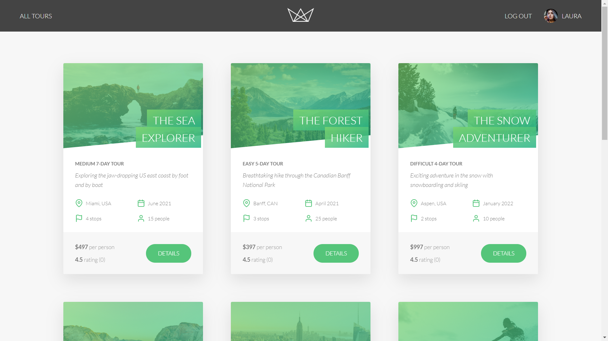

## TOURS APP API WITH FRONTEND

This is complete web -app with front end and backend .

this api is standalone api,made with full fleshed authorization,payments,email,photo upload,update,creating ,reading ,updating ,deleting (CRUD) rest api..it can query db,supports advanced db serch operartions,like sorting ,pagination,statistics and much more.this api supports a natours web app which supports many models and colllections.
this repo is code of full webapp which stands on this api.

### User can do this operartions easily in this api.

1. User can sign up,login.

2. Update password

3. Reset password

4. Upload ,update single or multiple photo

5. logout or delete his account

6. Create ,Read,Update,Delete ,Search Query users account through api alone.

7. Create ,Read,Update,Delete ,Search Query tours account through api alone.

8. Create ,Read,Update,Delete ,Search Query reviews through api alone.

9. Create ,Read,Update,Delete ,Search Query bookings account through api alone.

10. Make Payments through strike.

11. Send emails right from the api.

12. render views for front end.

## Notable technology used

1. Node.js - a backend framework in js

2. Sendgrid - for facilating emails.

3. Pug - for rendering views.

4. Mongodb - for database.

## For actual trial ,visit the preview link given above.

## Complete documentation of api is given here.

## for testing the this api.dummy data is as follow.

-> https://documenter.getpostman.com/view/11944008/T17Nbjug

### for login as (admin)

-> admin@natours.io
->test@1234

### for login as (user)

-> laura@example.com
-> test@1234

## Screenshots.

  </img>

### Homepage

  </img>

### My account

  </img>

### Tour details

  </img>

### Tour Deatals 2

  </img>

### Stripe payment

  </img>

### Sign up form

  </img>

### Sign Up email

  </img>

### Forgot password email
